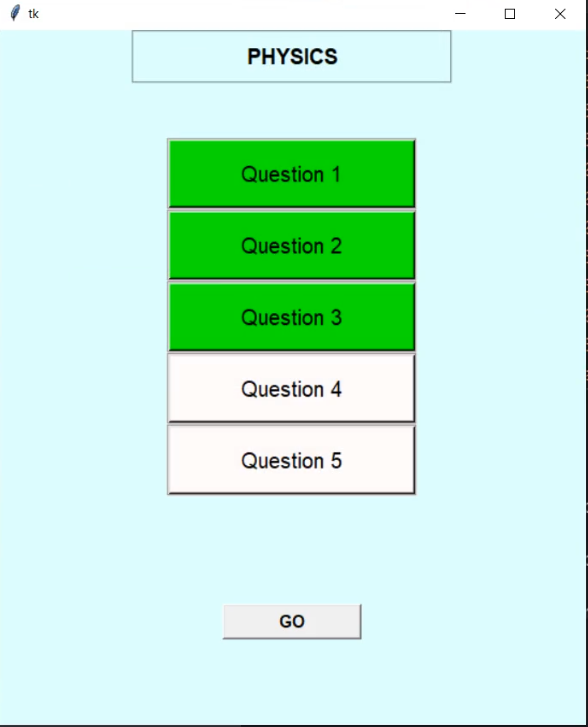

Quizzit is a GUI quiz conducting and assesment application made using Tkinter module of python and uses the SQL database.

A teacher can create MCQ type questions and add their correct answers which are stored in the database. 

The student can access the questions after entering his name and then attempt the questions. After completion off all the questions the student gets to see his total marks.

The teacher has the option to view to results of all the students to have appeared the test.

Home screen.

Teacher Login

Teacher choses subject and can select ADD to start making questions, he can view the results of all the students who will take the test by selecting RESULTS after the students have appeared the test

Teacher can select ADD to create new question

Teacher enters the question, its options and the correct option

One question created similarly the teacher can create more questions

Similarly the teacher can create more questions

Student enters his name and registration number to start the test

All the questions shown to the student

Student selects any question and the question opens up, the student can choose one option out of the 4 options

Attempted questions are shown in green so that student can keep track of his progress

After the student completes the test his/her score is displayed

Teacher can select the results button and view the result of all the students who have appeared the test 

